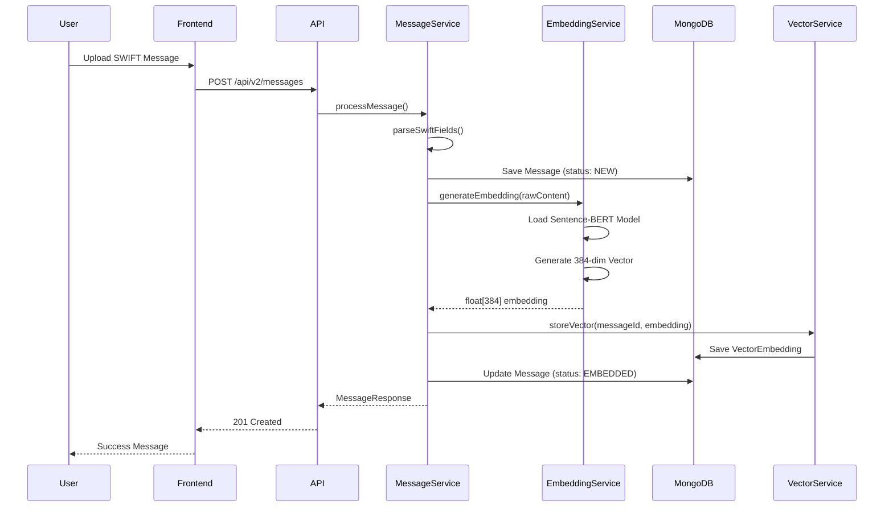
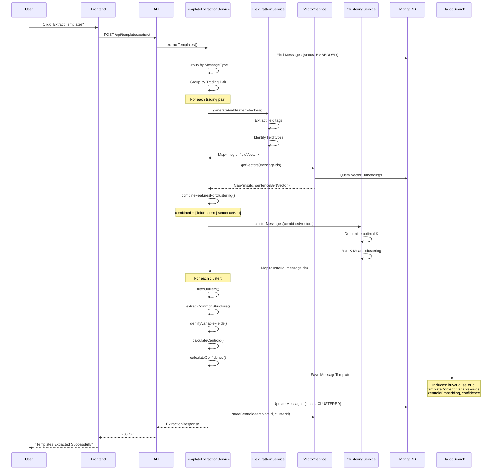
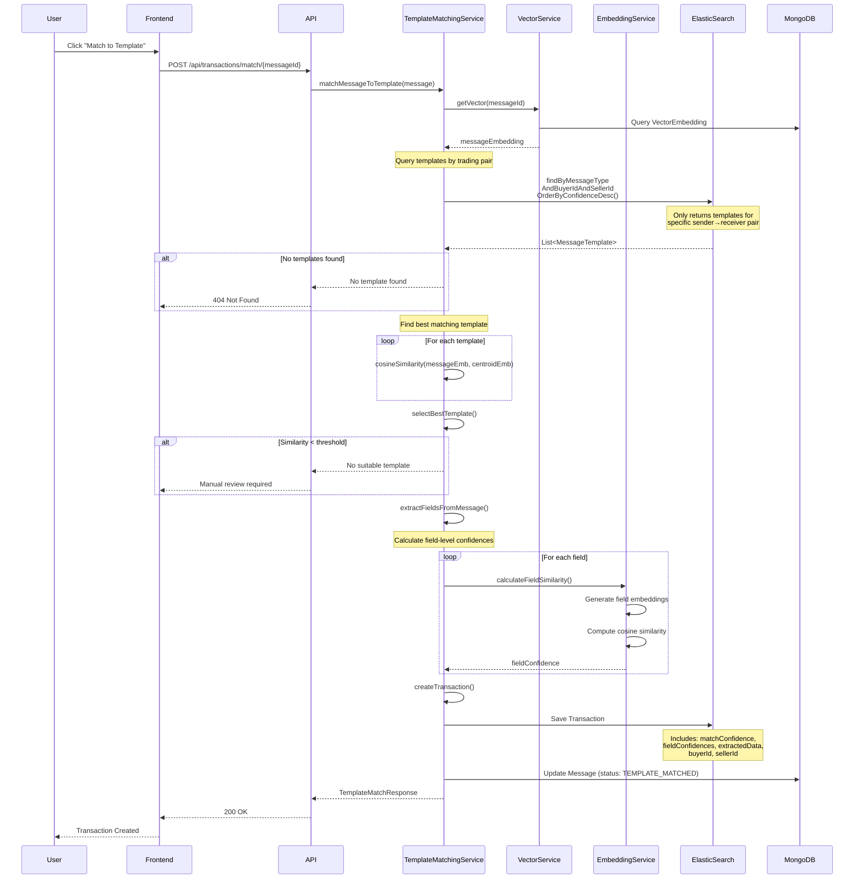

# SWIFT Template Extraction System

A comprehensive Java-based system for extracting templates from SWIFT trade finance messages using machine learning clustering and vector embeddings with trading pair scoping.

## Overview

This system automates the process of template extraction from SWIFT messages used in trade finance. It uses a hybrid approach combining structural field analysis and semantic embeddings to cluster messages, extract templates, and match incoming transactions.

### Key Features

- **Hybrid Clustering**: Combines field pattern vectors + Sentence-BERT embeddings (all-MiniLM-L6-v2)
- **Trading Pair Scoping**: Templates are scoped to specific sender-receiver pairs
- **Field-Level Confidence**: Semantic similarity scoring for individual SWIFT fields
- **Template Matching**: Match incoming transactions to saved templates with confidence scores
- **Real-time Processing**: Embedding generation and vector storage in MongoDB + ElasticSearch
- **JWT Authentication**: Secure API access with role-based authorization

## System Architecture

### High-Level Architecture

```
┌─────────────────────────────────────────────────────────────────────┐
│                          Frontend (React)                            │
│  ┌────────────┐  ┌────────────┐  ┌────────────┐  ┌──────────────┐ │
│  │  Upload    │  │  Clusters  │  │ Templates  │  │ Transactions │ │
│  │  Messages  │  │   View     │  │    View    │  │     View     │ │
│  └────────────┘  └────────────┘  └────────────┘  └──────────────┘ │
└────────────────────────────┬────────────────────────────────────────┘
                             │ REST API (JWT Auth)
┌────────────────────────────┴────────────────────────────────────────┐
│                    Backend (Spring Boot)                             │
│  ┌──────────────────────────────────────────────────────────────┐  │
│  │                     API Controllers                           │  │
│  │  MessageController │ TemplateController │ TransactionController│ │
│  └────────────┬─────────────────────┬────────────────┬──────────┘  │
│               │                     │                 │              │
│  ┌────────────┴─────────────────────┴─────────────────┴──────────┐ │
│  │                      Service Layer                             │ │
│  │  ┌──────────────┐  ┌──────────────────┐  ┌──────────────────┐│ │
│  │  │  Embedding   │  │    Clustering    │  │     Template     ││ │
│  │  │   Service    │  │     Service      │  │  Matching Service││ │
│  │  └──────────────┘  └──────────────────┘  └──────────────────┘│ │
│  │  ┌──────────────┐  ┌──────────────────┐  ┌──────────────────┐│ │
│  │  │Field Pattern │  │      Vector      │  │      Auth        ││ │
│  │  │   Service    │  │     Service      │  │     Service      ││ │
│  │  └──────────────┘  └──────────────────┘  └──────────────────┘│ │
│  └────────────────────────────────────────────────────────────────┘ │
└────────────┬────────────────────────┬──────────────────────────────┘
             │                        │
    ┌────────┴────────┐      ┌───────┴────────┐
    │   MongoDB       │      │ ElasticSearch  │
    │  - Messages     │      │  - Templates   │
    │  - Users        │      │  - Vectors     │
    │  - Embeddings   │      │  - Centroids   │
    └─────────────────┘      └────────────────┘
```

### Technology Stack

**Backend:**
- Java 17 + Spring Boot 3.2.0
- Spring Data MongoDB
- Spring Data ElasticSearch
- Spring Security + JWT
- Sentence Transformers (all-MiniLM-L6-v2)
- Apache Commons Math3 (K-Means clustering)

**Frontend:**
- React 18 with Vite
- React Router v6
- Axios for HTTP
- Recharts for visualizations
- Custom CSS styling

**Storage:**
- MongoDB 7.0 (Messages, Users, Vector Embeddings)
- ElasticSearch 8.11.0 (Templates, Search, Aggregations)

**Infrastructure:**
- Docker Compose orchestration
- Nginx reverse proxy

## Methodology

### 1. Hybrid Vector Clustering

The system uses a **two-stage hybrid approach** combining structural and semantic analysis:

#### Stage 1: Field Pattern Vectors (Structural)
- Extracts SWIFT field tags (e.g., :20:, :32A:, :50K:)
- Identifies field types (AMOUNT, DATE, CODE, TEXT)
- Captures field presence/absence patterns
- Includes trading pair information (senderId + receiverId)

**Dimension:** Variable (depends on unique fields in dataset)

#### Stage 2: Sentence-BERT Embeddings (Semantic)
- Uses `all-MiniLM-L6-v2` transformer model
- Generates embeddings of **entire SWIFT message content**
- Captures semantic meaning and relationships
- Allows "PROHIBITED" and "NOT ALLOWED" to cluster together

**Dimension:** 384 (fixed by model)

#### Hybrid Combination
```java
combined_vector = [field_pattern_vector | sentence_bert_embedding]
                  [variable dimensions   | 384 dimensions        ]
```

This hybrid vector is used for K-Means clustering.

### 2. Trading Pair Scoping

Templates are **isolated by trading pair** (sender → receiver):
- Messages from Bank A → Bank B create separate templates
- Messages from Bank A → Bank C create different templates
- Incoming messages only match templates from their specific trading pair

**Benefits:**
- Prevents cross-contamination between trading partners
- Captures relationship-specific patterns
- Improves matching accuracy

### 3. Field-Level Confidence Scoring

Each field in a matched message receives its own confidence score:
- **Pattern Match (1.0)**: Field follows template pattern exactly
- **Semantic Similarity (0.5-1.0)**: Calculated using Sentence-BERT
- **Variable Field (0.95)**: Expected to vary
- **Missing Field (0.0)**: Field not in template

Overall confidence = Average of field confidences

## Sequence Diagrams

### 1. Message Upload & Embedding Generation



### 2. Template Extraction & Clustering



### 3. Incoming Transaction Matching



## Data Flow

### Message Processing Pipeline

1. **Upload** → Message saved to MongoDB (status: NEW)
2. **Embedding Generation** → Sentence-BERT generates 384-dim vector (status: EMBEDDED)
3. **Clustering** → Messages grouped by trading pair and clustered (status: CLUSTERED)
4. **Template Extraction** → Templates created and saved to ElasticSearch
5. **Matching** → Incoming messages matched to templates (status: TEMPLATE_MATCHED)
6. **Transaction Creation** → Transaction record saved with field confidences

## Project Structure

```
template-extraction-poc/
├── backend/
│   ├── src/main/java/com/tradefinance/templateextraction/
│   │   ├── config/          # Configuration classes
│   │   ├── controller/      # REST API controllers
│   │   ├── dto/             # Data transfer objects
│   │   ├── model/           # Domain models
│   │   ├── repository/      # ElasticSearch repositories
│   │   ├── service/         # Business logic services
│   │   └── util/            # Utility classes
│   ├── src/main/resources/
│   │   └── application.yml  # Application configuration
│   ├── Dockerfile
│   └── pom.xml
├── frontend/
│   ├── src/
│   │   ├── components/      # React components
│   │   ├── pages/           # Page components
│   │   ├── services/        # API service layer
│   │   ├── App.jsx
│   │   └── main.jsx
│   ├── Dockerfile
│   ├── nginx.conf
│   └── package.json
└── docker-compose.yml
```

## Features

### 1. Message Upload
- Upload single SWIFT messages via form
- Bulk upload via file
- Automatic parsing of SWIFT field tags
- Embedding generation on upload

### 2. Template Extraction
- Automatic clustering of similar messages
- Template generation with variable field identification
- Confidence scoring based on cluster cohesion
- Support for all MT7xx message types

### 3. Transaction Processing
- Match incoming messages to templates
- Extract structured data from messages
- Confidence-based matching
- User data entry and validation

### 4. Dashboard
- Real-time statistics
- Message type distribution
- Processing status overview
- Transaction metrics

## Getting Started

### Prerequisites
- Docker Desktop
- Docker Compose
- 8GB+ RAM recommended

### Installation & Running

1. **Clone or navigate to the project directory**
```bash
cd template-extraction-poc
```

2. **Start all services with Docker Compose**
```bash
docker-compose up --build
```

This will start:
- ElasticSearch on port 9200
- Backend API on port 8080
- Frontend on port 3000

3. **Access the application**
- Frontend: http://localhost:3000
- Backend API: http://localhost:8080/api
- ElasticSearch: http://localhost:9200

### First Time Setup

1. **Upload sample messages**
   - Navigate to "Upload" page
   - Click "Load Sample" to see a sample MT700 message
   - Upload the message

2. **Extract templates**
   - Navigate to "Templates" page
   - Click "Extract Templates"
   - Wait for clustering and template generation

3. **Process transactions**
   - Navigate to "Transactions" page
   - Click "Match to Template" for unmatched messages
   - View transaction details

## API Endpoints

### Authentication
- `POST /api/auth/register` - Register new user (requires invitation token)
- `POST /api/auth/login` - Login and receive JWT token
- `POST /api/auth/invite` - Send invitation email (Admin only)
- `GET /api/auth/me` - Get current user profile

**Default Admin Account:**
- Email: `admin@swift.com`
- Password: `SwiftAdmin2024`

### Messages (V2)
- `POST /api/v2/messages` - Upload single message (requires JWT)
- `GET /api/v2/messages` - Get all messages with pagination
- `GET /api/v2/messages/{id}` - Get message by ID
- `GET /api/v2/messages/count` - Get total message count
- `POST /api/v2/messages/embed/{id}` - Generate embedding for message
- `GET /api/v2/messages/statistics` - Get message statistics
- `DELETE /api/v2/messages/{id}` - Delete message (Admin only)

### Templates
- `GET /api/templates` - Get all templates
- `GET /api/templates/{id}` - Get template by ID
- `GET /api/templates/type/{type}` - Get templates by message type
- `POST /api/templates/extract` - Extract templates from EMBEDDED messages
- `GET /api/templates/statistics` - Get template statistics
- `DELETE /api/templates/{id}` - Delete template (Admin only)

### Transactions
- `GET /api/transactions` - Get all transactions
- `GET /api/transactions/{id}` - Get transaction by ID
- `GET /api/transactions/template/{templateId}` - Get transactions by template
- `GET /api/transactions/status/{status}` - Get transactions by status
- `POST /api/transactions/match/{messageId}` - Match message to template
- `PUT /api/transactions/{id}` - Update transaction with user data
- `GET /api/transactions/statistics` - Get transaction statistics

### Clusters
- `GET /api/clusters` - Get cluster information with messages
- `GET /api/clusters/statistics` - Get clustering statistics

**Authentication:** All endpoints except `/api/auth/login` and `/api/auth/register` require JWT token in `Authorization: Bearer <token>` header.

## Configuration

### Backend Configuration (application.yml)

```yaml
spring:
  elasticsearch:
    uris: http://elasticsearch:9200

template:
  extraction:
    clustering:
      max-iterations: 100
      min-clusters: 2
      max-clusters: 10
    embeddings:
      dimension: 384
      cache-size: 10000
    similarity:
      threshold: 0.85
```

### ElasticSearch Configuration

Configured in docker-compose.yml:
- Single node mode
- Security disabled for development
- 1GB heap size
- Persistent volume for data

## SWIFT Message Types Supported

- **MT700**: Issue of a Documentary Credit
- **MT710**: Advice of a Third Bank's Documentary Credit
- **MT720**: Transfer of a Documentary Credit
- **MT730**: Acknowledgement
- **MT740**: Authorization to Reimburse
- **MT750**: Discrepancy Notice

## Template Extraction Algorithm (Detailed)

### Phase 1: Data Preparation
1. **Message Collection**: Retrieve all messages with status EMBEDDED from MongoDB
2. **Grouping by Message Type**: Group messages by SWIFT message type (MT103, MT700, etc.)
3. **Trading Pair Grouping**: Further group by sender-receiver pair (buyerId-sellerId)

### Phase 2: Feature Engineering
4. **Field Pattern Generation**:
   - Extract SWIFT field tags present in each message
   - Identify field types (AMOUNT, DATE, CODE, etc.)
   - Create variable-dimension structural vectors

5. **Sentence-BERT Embeddings**:
   - Retrieve pre-generated 384-dimensional embeddings
   - Generated using all-MiniLM-L6-v2 model

6. **Vector Combination**:
   - Concatenate field pattern + Sentence-BERT vectors
   - Creates hybrid vector: `[field_pattern | sentence_bert]`

### Phase 3: Clustering
7. **Optimal K Detection**: Determine number of clusters using elbow method
8. **K-Means Clustering**: Cluster messages using combined hybrid vectors
9. **Outlier Filtering**: Remove statistical outliers using IQR and standard deviation methods

### Phase 4: Template Generation
10. **Common Structure Extraction**: Find invariant fields across cluster
11. **Variable Field Identification**: Detect fields that vary (dates, amounts, codes, text)
12. **Centroid Calculation**: Calculate cluster centroid from Sentence-BERT embeddings
13. **Confidence Scoring**: Calculate confidence based on cluster cohesion
14. **Quality Assessment**: Compute template quality score (volume + similarity + field consistency)

### Phase 5: Storage
15. **Template Persistence**: Save to ElasticSearch with:
    - buyerId and sellerId (trading pair)
    - templateContent (structure with placeholders)
    - variableFields (list of variable field definitions)
    - centroidEmbedding (384-dim vector)
    - confidence score and metadata
16. **Message Update**: Update clustered messages status to CLUSTERED
17. **Centroid Storage**: Store template centroid in MongoDB for quick retrieval

## Variable Field Types

The system automatically detects:
- **AMOUNT**: Currency amounts (e.g., USD100000,00)
- **DATE**: Date formats (e.g., 251231)
- **CODE**: Alphanumeric codes (e.g., BANKBEBB)
- **NUMERIC**: Pure numbers
- **ALPHANUMERIC**: Mixed alphanumeric
- **TEXT**: Free text fields

## Matching Algorithm & Confidence Calculation

### Template Matching Process

1. **Trading Pair Filtering**: Query only templates for specific sender→receiver pair
2. **Vector Comparison**: Calculate cosine similarity between message embedding and template centroids
3. **Best Template Selection**: Choose template with highest similarity score
4. **Threshold Check**: Ensure similarity exceeds configured threshold (default: 0.85)

### Multi-Level Confidence Scoring

#### 1. Document-Level Confidence (Template Match)
- Cosine similarity between message embedding and template centroid
- Range: 0.0 - 1.0
- Used for overall template match confidence

#### 2. Field-Level Confidence (Per-Field Scoring)
Each SWIFT field gets individual confidence:

**Pattern Match (1.0):**
```
Template: :32A:{VARIABLE}
Message:  :32A:251231USD100000,00
Confidence: 1.0 (perfect pattern match)
```

**Semantic Similarity (0.5-1.0):**
```
Template field: "DOCUMENTS PROHIBITED"
Message field:  "DOCUMENTS NOT ALLOWED"
Confidence: 0.89 (high semantic similarity via Sentence-BERT)
```

**Variable Field (0.95):**
```
Field is marked as variable in template
Confidence: 0.95 (expected to vary)
```

**Missing Field (0.0):**
```
Field exists in template but not in message
Confidence: 0.0 (data quality issue)
```

#### 3. Combined Confidence
```
Overall Confidence = 0.5 × (Avg Field Confidence)
                   + 0.3 × (Structural Similarity)
                   + 0.2 × (Document-Level Similarity)
```

This weighted approach prioritizes field-level accuracy while considering overall structure and semantic meaning.

## Development

### Backend Development

```bash
cd backend
mvn spring-boot:run
```

### Frontend Development

```bash
cd frontend
npm install
npm run dev
```

### Building

Backend:
```bash
cd backend
mvn clean package
```

Frontend:
```bash
cd frontend
npm run build
```

## Monitoring

### ElasticSearch Health
```bash
curl http://localhost:9200/_cluster/health
```

### Application Logs
```bash
# View all logs
docker-compose logs -f

# View specific service
docker-compose logs -f backend
docker-compose logs -f frontend
docker-compose logs -f elasticsearch
```

## Troubleshooting

### ElasticSearch won't start
- Check available memory (needs 1GB+)
- Ensure port 9200 is not in use
- Check Docker logs: `docker-compose logs elasticsearch`

### Backend can't connect to ElasticSearch
- Wait for ElasticSearch health check to pass
- Check network connectivity: `docker-compose ps`
- Verify ElasticSearch URL in application.yml

### Frontend can't reach backend
- Ensure backend is running: `curl http://localhost:8080/api/messages`
- Check CORS configuration in WebConfig.java
- Verify proxy settings in vite.config.js

## Future Enhancements

- [ ] Integrate actual Sentence Transformers model
- [ ] Add user authentication and authorization
- [ ] Implement real-time message processing
- [ ] Add support for more SWIFT message types
- [ ] Enhanced template editing capabilities
- [ ] Export/import templates
- [ ] Advanced analytics and reporting
- [ ] Machine learning model retraining
- [ ] Multi-language support
- [ ] Audit logging

## License

This is a proof-of-concept project for demonstration purposes.

## Support

For issues or questions, please check the application logs and ElasticSearch health status.
